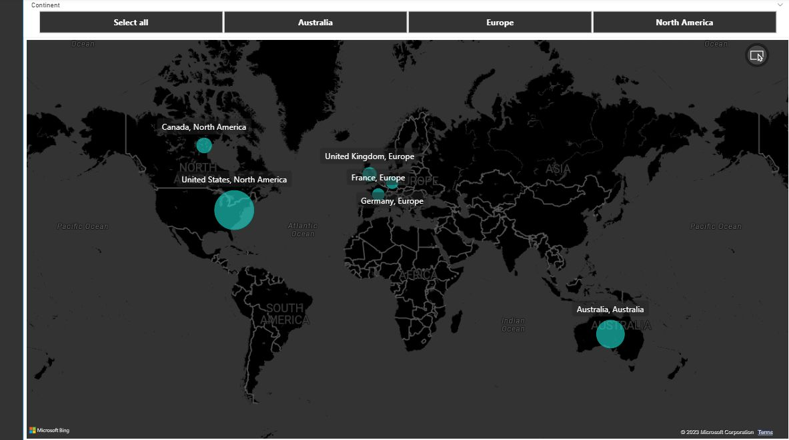
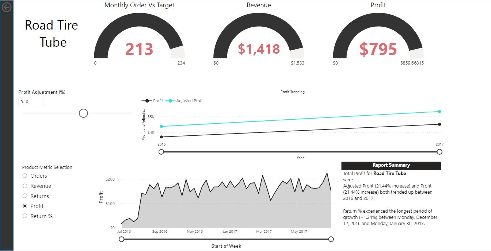

# AW_Report_PowerBI

  
  

This GitHub repository contains datasets related to Adventure Works Motorcycles, a company operating in multiple countries. The datasets cover various aspects of the company's operations, including product data, calendar information, and transaction records.

The repository hosts a comprehensive Power BI report that provides insights and analysis at different levels of detail. The report includes key performance indicators (KPIs), interactive maps, gauges, bar charts, and a variety of other responsive chart types.

Features of the Power BI Report:
1. Top-Level Summary: The report offers an overview of Adventure Works Motorcycles' performance, highlighting essential KPIs such as revenue, sales growth, and customer satisfaction. The top-level summary provides a quick snapshot of the company's performance.

2. Drill-Down Analysis: Users can dive deeper into the report to explore specific areas of interest. The report allows users to drill down from high-level metrics to more granular details, providing a comprehensive view of the company's operations.

3. Geographic Analysis: The Power BI report includes interactive maps that showcase the countries in which Adventure Works Motorcycles operates. Users can analyze sales and customer distribution geographically, enabling them to identify opportunities and potential challenges in different regions.

4. Responsive Visualizations: The report employs a variety of responsive and dynamic chart types to present data effectively. Users can interact with the charts, apply filters, and zoom in on specific time periods or product categories, enhancing their ability to derive meaningful insights.

This repository serves as a valuable resource for analysts, data professionals, and enthusiasts interested in exploring Adventure Works Motorcycles' data. The Power BI report offers a comprehensive analysis of the company's performance, enabling users to gain actionable insights and make informed decisions.

To utilize the report, clone the repository and open it in Power BI Desktop. Explore the different visuals, filter the data based on your specific requirements, and leverage the rich set of features to gain a comprehensive understanding of Adventure Works Motorcycles' operations.

Note: The dataset included in this repository is specific to Adventure Works Motorcycles and may not reflect real-time or updated data.

